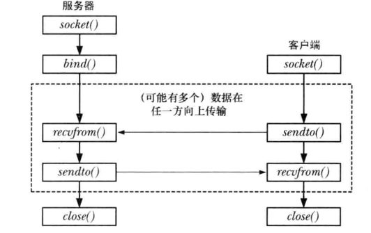
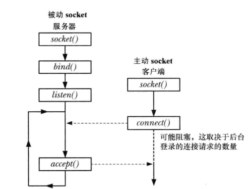
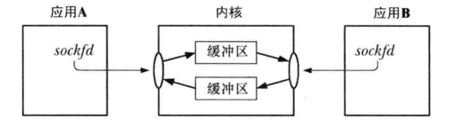

# 56 socket 介绍
章节内容概要：
1. 56 章：对 socket API 的全面介绍
2. 57 章：介绍 UNIX domain socket，它允许位于同一主机系统上的应用程序之间通信
3. 58 章：介绍各种计算机联网概念并描述 TCP/IP 联网协议的关键特性
4. 59 章：介绍 Internet domain socket，它允许位于不同主机上的应用程序之间通过 TCP/IP 通信
5. 60 章：使用 socket 的服务设计
6. 61 章：高级话题，包括 socket I/O 的其他特性，TCP 协议的细节信息以及如何使用 socket 选项来获取和修改 socket 的各种特性


## 1. 基础概念
### 1.1 socket 创建
1. socket 通信的方式：
  - 各个应用程序创建一个 socket，socket是一个允许通信的"设备"
  - 服务器将自己的 socket 绑定到一个众所周知的地址上，使得客户端能够定位到它得位置
2. socket 创建: `fd = socket(domain, type, protocol)`
  - domain：socket 存在于一个通信 domain 中
  - type：socket 类型
  - protocol：通常都为 0

### 1.2 通信 domain
1. 作用：
  - 识别出一个 socket 的方法(即 socket 地址的格式)
  - 通信范围，即是在位于同一主机上的应用程序之间还是在位于使用一个网络链接起来的不同主机上的应用程序之间
2. 可选值：
  1. UNIX(AF_UNIX)domain：允许在同一主机上的应用程序之间进行通信
  2. IPv4(AF_INET)domain:允许使用因特网协议第 4 版链接起来的主机上的应用程序之间进行通信
  3. IPv6(AF_INET6)domain:允许使用因特网协议第 6 版链接起来的主机上的应用程序之间进行通信
3. 附注：
  - AF 前缀表示地址簇(address family)
  - PF 前缀表示协议簇(protocol family)
  - 二者的值通常是一一对应的

|Domain|执行的通信|应用程序之间的通信|地址格式|地址结构|
|:---|:---|:---|:---|:---|
|AF_UNIX|内核中|同一主机|路经名|sockaddr_un|
|AF_INET|IPv4|通过 IPv4 网络连接起来的主机|32位IPv4 地址+16位端口号|sockaddr_in|
|AF_INET6|IPv6|通过 IPv4 网络连接起来的主机|128位IPv6地址+16位端口号|sockaddr_in6|

### 1.3 socket 类型
|属性|流|数据报|
|:---|:---|:---|
|可靠传递？|是|否|
|消息边界保留|否|是|
|面向连接|是|否|

1. 流(SOCKET_STREAM):
  - 作用：提供了一个可靠的双向的字节流通信信道，通常被称为面向连接的
  - 特性：
    - 可靠的：表示可以保证发送者传输的数据会完整无缺的到达接受应用程序，或收到一个传输失败的通知
    - 双向的：表示数据可以在两个 socket 之间的任意方向上传输
    - 字节流：表示与管到一样，不存在消息边界的概念
  - **协议**：使用传输控制协议(TCP) -- TCP socket
2. 数据报(SOCKET_DGRAM)：
  - 作用：允许数据以被称为**数据报**的消息的形式进行交换
  - 特性：
    - 消息的边界得到了保留
    - 数据传输是不可靠的
    - 消息的到达可能是无序的，重复的，或根本无法到达
    - 在使用时，无需与另一个 scoket 连接
  - **协议**：使用了用户数据报协议(UDP) --- UDP socket
3. 附注：
  - 这两种 scoket 类型在 UNIX 和 internet domain 中都得到了支持

## 2. 流 socket 连接过程


流 socket 类似于**电话系统**
1. 服务器，客户端各自创建一个 socket  -- 类似于**安装了一个电话**
2. 服务器调用 bind 将 socket 绑定到一个众所周知的地址上，然后调用 listen()
通知内核它接受接入连接的意愿  -- 类似**已经有了一个众所周知的电话号码，并打开了电话**
2. 客户端调用 connect() 建立连接，同时指定需连接的 socket 的地址 -- 类似于**拨某人电话号码**
3. 服务器使用 accept() 接受连接(类似于**电话响起，接听电话**)。
如果在对等应用程序调用 connect() 之前执行了 accetp(), accetp() 就会阻塞(**等待电话**)
4. 连接建立之后，就可以在应用程序之间进行双向数据传输直到其中一个使用了 close() 关闭连接为止
5. 通信是通过 read(),write() 或提供了额外功能的 socket 特定的系统调用来完成的

## 3. 数据报 socket 连接过程


数据报 socket 类似于邮政系统
1. socket 系统调用等价于创建一个邮箱
2. 服务器端调用 bind() 将 socket 绑定到一个众所周知的地址上，客户端通过该向该地址发送一个
数据报来发起通信，一些domain中，特别是 UNIX domain 客户端如果想要接受服务器发送来的数据报，
可能需要使用 bind() 将一个地址赋给其 socket
3. 要发送一个数据报，需要调用 sendto()，其中一个参数是数据报发送到的 socket 地址，
类似于将收信人的地址写到信件上并投递这封信
4. 为接受一个数据报，需要调用 recvfrom(),它在没有数据到达时回阻塞。
由于 recvfrom() 允许获取发送者的地址，因此可以在需要的时候发送一个响应
5. 不需要 socket 时，应用程序调用 close() 关闭 socket

### 3.1 在数据报 socket 上使用 connect()
1. 作用：
  - 导致内核记录这个 socket 的对等 socket 地址
  - 已连接的数据报 socket 指代的就是调用了 connect() 的数据报 socket
2. 影响：
  - 数据报的发送，可在 socket 上使用 write()(或 send) 来完成，并会自动发送到同样的对等 socket 上，
  与 sendto() 一样，每次调用 write() 发送一个数据报
  - 这个 socket 上只能读取由对等 socket 发送的数据报
  - 上述论断只使用于调用了 connect() 的数据报，不适用于它连接的远程 socket
  - 通过在发起一个 connect() 调用可以修改一个已连接的数据报 socket 的对等 socket
  - 通过指定一个地址簇为 AF_UNSPEC 的地址结构还可以解除对等关联关系
  
## 4 socket 系统调用
### 4.1 通用 socket 地址结构
struct sockaddr:
  - 作用：将各种 domain 特定的地址结构转换成单个类型以供 socket 系统调用中的各个参数使用
  - 结构：通过 socket domain 即 sa_family 字段的值足以确定剩余部分中的地址的大小和格式
  ```C
  struct sockaddr{
    sa_family_t sa_family;  /\* socket domain 的类型值(AF_*) \*/
    char        sa_data[14]; /\* socket 地址的长度 \*/
  }
  ```

### 4.2 流 socket 相关的 socket 系统调用
1. socket(): 创建一个新的 socket
2. bind():
  - 作用：将一个 socket 绑定到一个地址上
  - 适用：通常服务器需要使用此方法将其 socket 绑定到一个众所周知的地址上，使得客户端能够定位
3. listen(): 允许一个流 socket 接受来自其他 socket 的接入连接
4. accept():
  - 在一个监听流 socket 上接受来自一个对等应用程序的连接，并可选地返回对等 socket 地址
  - 调用时不存在未决连接，那么调用那就会阻塞直到有连接请求到达为止
5. connect(): 建立与另一 socket 之间的连接

#### int socket(int domain, int type, int protocol)
  - 返回：
    - 成功时返回一个新创建的 socket 的文件描述符
    - 失败时返回 -1
  - 参数：
    - domain:
    - type:
    - protocol: 通常都是 0
  - Linux 特性：
    - type 参数允许两个非标准的标记与 socket 类型取 OR
      - SOCKET_CLOEXEC: 为新创建的文件描述符启用 close-on-exec 标志
      - SOCKET_NONBLOCK: 为新创建的文件描述符设置 O_NONBLOCK，即设置 I/O 操作非阻塞

#### int bind(int sockfd, const struct sockaddr \*addr, socklen_t addrlen)
  - 返回：
    - 成功返回 0
    - 失败返回 -1
  - 参数：
    - sockfd： socket() 调用返回到文件描述符
    - addr：指针，指向一个指定该 socket 绑定到的地址的结构，取决于 socket domain
    - addrlen：指定了地址结构的大小

#### int listen(int sockfd, int backlog)
  - 注解：
    - 客户端可能会在服务器调用 accept() 之前调用 connect() 此时会产生一个未决连接
    - 内核必须要记录所有未决的连接请求的相关信息，以便后续的 accetp() 能够处理这些请求
  - 返回：
    - 成功返回 0
    - 失败返回 -1
  - 参数：
    - sockfd： socket 文件描述符
    - backlog：
      - 作用：限制未决连接的数量
      - 限制之内的连接请求会立即成功(TCP socket 更复杂详细见后)
      - 限制之外的连接请求会阻塞直到一个未决的连接被接受，并从未决连接队列删除为止

  


#### int accept(int sockfd, struct sockaddr \*addr,  socklen_t \*addrlen)
  - 返回：
    - 成功时
      - 会创建新的 socket，这个 socket 会与执行 connect() 的对等 socket 进行连接
      - 返回已连接的 socket 文件描述符
      - 监听 socket 会保持打开状态，并且可以被用来接受后续的连接
    - 失败时返回 -1
  - 参数：
    - addr：指向一个用来返回 socket 地址的结构
    - addrlen：
      - 指向一个整数，在调用被执行之前必需将其初始化为 addr 指向的缓冲区大小
      - accept 返回之后，这个整数会被设置成实际复制进缓冲区中的数据的字节数
    - 附注：如果不关心对等 socket 地址，可将 addr，addrlen 指定为 NULL，0
  - Linux 特性：
    - 支持新的 accept4()调用，提供了额外的 flag 参数，用来修改系统调用的行为
    - 支持两个标记：SOCKET_CLOEXEC 和 SOCKET_NONBLOCK

#### int connect(int sockfd, struct sockaddr \*addr,  socklen_t \*addrlen)
  - 作用：将 sockfd 连接到地址通过 addr，addrlen 指定的监听 socket 上
  - 参数：addr，addrlen 参见 bind()

#### int close(int sockfd)**
  - 作用：终止一个流 socket 连接
  - 附注：
    - 如果多个文件描述符引用了同一个 socket，那么当所有描述符被关闭后，连接终止
    - 61.2 节将会描述 shutdown() 系统调用，届时将会对如何关闭流 socket 连接提供详细细节

#### 流 socket I/O



- 一对连接的流 socket 在两个端点之间提供了一个双向通信信道
- 要执行 I/O 需要使用 read(),write() 系统调用(或 61.3 节描述的 send(),recv())
- 连接是双向的，连接两端都可以使用上述调用
- 一个 socket 可以使用 close() 关闭或在应用程序终止后关闭，之后当对等应用程序试图从连接另一
端读取数据时将会收到文件结束(当所有缓冲数据都被读取之后)；如果对等应用程序试图向其 socket
写入数据，会收到一个 SIGPIPE 信号，并且系统调用会返回 EPIPE 错误

### 4.3 数据报 socket 相关的系统调用
1. recvfrom：接受数据报
2. sendto: 发送数据报

**recvfrom(int sockfd, void \*buffer, size_t length, int flag,
  struct sockaddr *src_addr, socklen_t *addrlen)**
  - 返回:
    - 成功时，返回接受到的数据字节数
    - 失败时，返回 -1
  - 参数：
    - 前三个参数与 read(), write() 相同
    - length:
      - 不管 length 的参数值是多少，recvfrom() 只会读取一条消息
      - 如果消息的大小超过 length 消息会被静默截断为 length 字节
    - flags: 位掩码，控制着 socket 特定的 I/O 特性，61.3 节详细介绍
    - src_addr, addrlen 返回发送数据报的远程 socket 地址，与 accept() 类似
  - 附注：
    - recv() 等价于 src_addr, addrlen 为 NULL 和 0 时的recvfrom()
    - read() 等价于 flag 为 0 时的 recv()

**sendto(int socket, const void *buffer, size_t length, int flag,
  const struct sockaddr *dest_addr, socklen_t addrlen)**
  - 返回:
    - 成功时，返回发送的字节数
    - 失败时，返回 -1
  - 参数：
    - 前三个参数与 read(), write() 相同
    - flags: 位掩码，控制着 socket 特定的 I/O 特性，61.3 节详细介绍
    - dest_addr, addrlen 指定目标 socket 地址，于 connect() 类似
